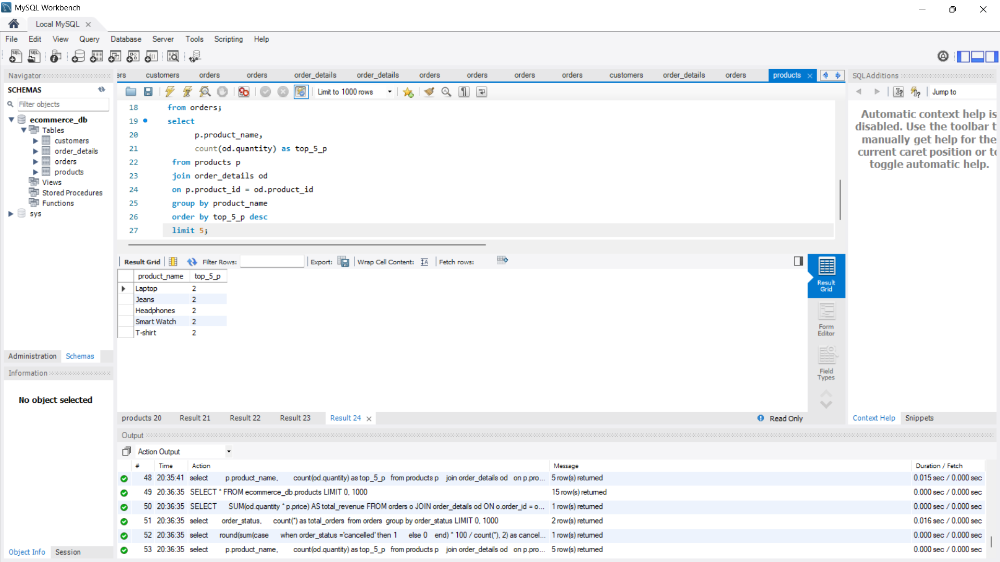
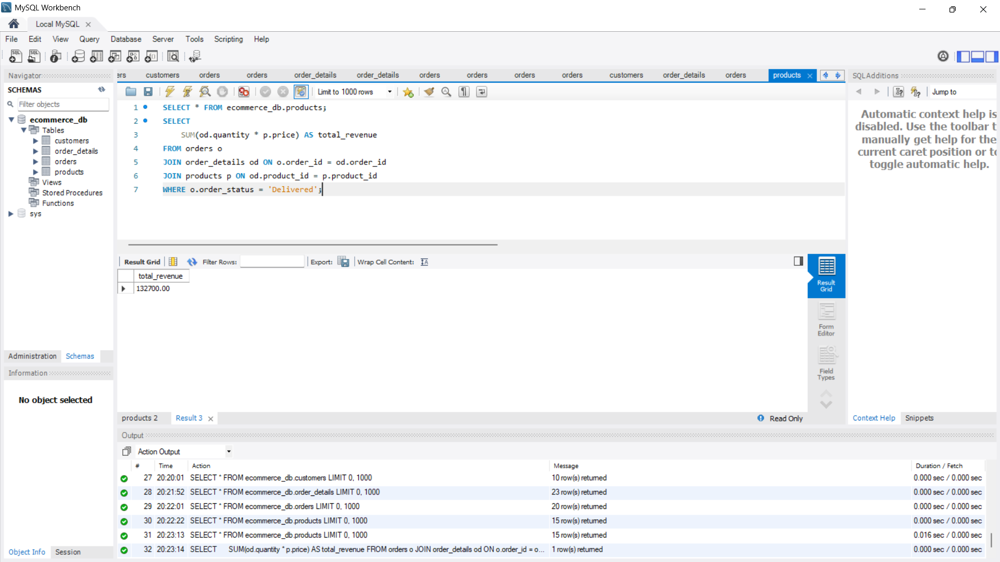
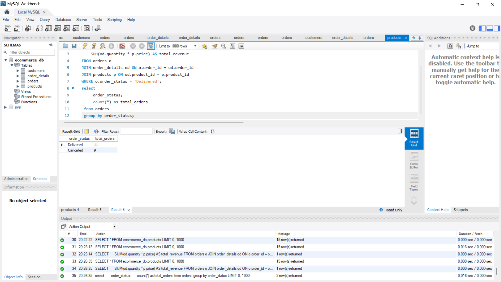
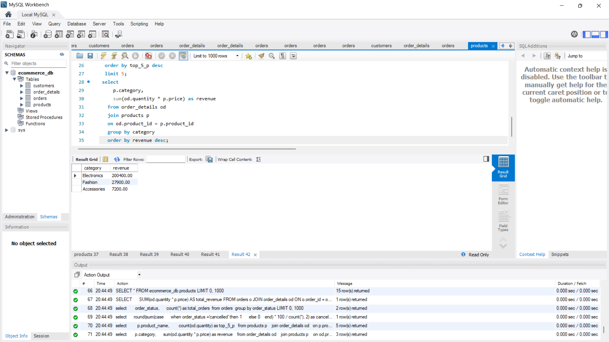
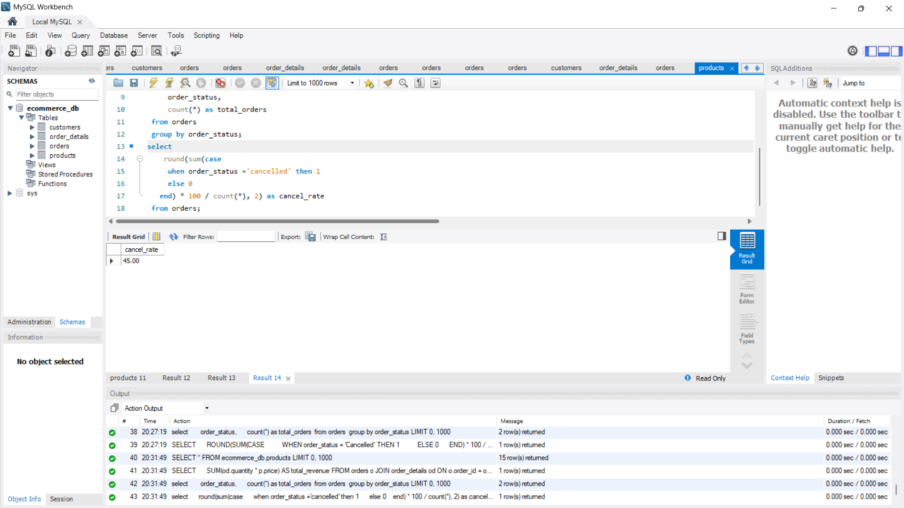
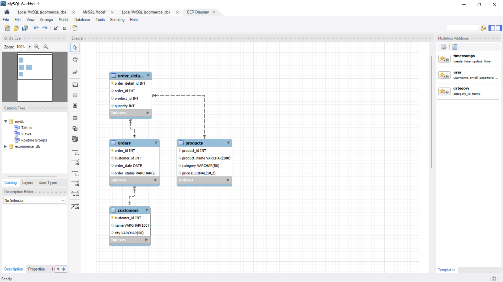

# ecommerce-sales-analysis
SQL-based analysis of e-commerce data to extract business insights
## Top 5 Most Ordered Products
 

## Total Revenue from Delivered Orders

## Order Status Analysis

This analysis shows the distribution of order statuses.  
We can observe that most orders are successfully delivered, while a portion gets cancelled, indicating potential areas for improvement in order fulfillment.

## Revenue by Product Category

This analysis shows which product categories generate the most revenue.  
Electronics contributes the highest revenue, indicating strong demand in this category.

## Order Cancellation Rate

This analysis calculates the percentage of cancelled orders.  
A high cancellation rate (45%) indicates potential issues in order processing, delivery, or customer satisfaction.

 

## Database Schema (EER Diagram)

This diagram represents the structure of the e-commerce database and relationships between tables:

### Tables Overview:

- **customers**
  - customer_id (Primary Key)
  - name
  - city

- **orders**
  - order_id (Primary Key)
  - customer_id (Foreign Key)
  - order_date
  - order_status

- **order_details**
  - order_detail_id (Primary Key)
  - order_id (Foreign Key)
  - product_id (Foreign Key)
  - quantity

- **products**
  - product_id (Primary Key)
  - product_name
  - category
  - price

### Relationships:

- One **customer** can have multiple **orders**
- One **order** can have multiple **order_details**
- One **product** can appear in multiple **order_details**

